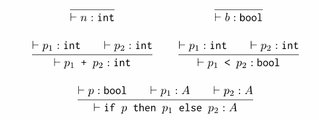
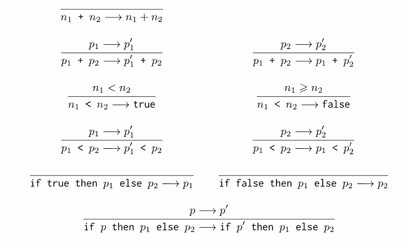

# [WIP] 

Un interpréteur pour un langage de programmation minimal implémenté en Rust, avec inférence de types et évaluation d'expressions.

## Fonctionnalités

- **Système de Types** : Vérification statique des types avec deux types de base :
  - `TBool` - Valeurs booléennes
  - `TInt` - Valeurs entières (u16)

- **Opérations Supportées** :
  - Arithmétique : Addition (`+`)
  - Comparaison : Inférieur à (`<`)
  - Contrôle de flux : Expressions conditionnelles (`if-then-else`)
  - Littéraux : Constantes booléennes et entières

- **Inférence de Types** : Vérification automatique des types 
- **Évaluation d'Expressions** : Réduction et normalisation étape par étape des expressions

## Règles de Typage

## Règles de réduction 

